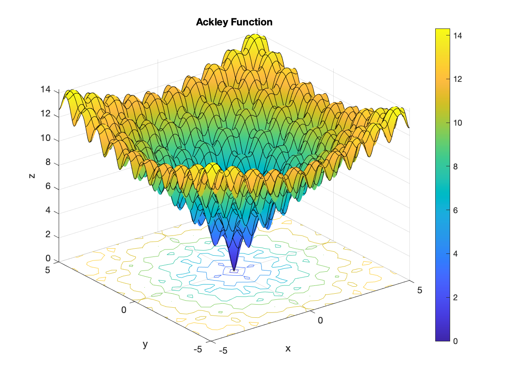

# MATLAB Examples
Various MATLAB examples. 

## Optimization

### Ackley Function



```
                                                        First-order 
 Iteration  Func-count       f(x)        Step-size       optimality
     0           3          3.62538                          1.64
     1          72      3.55271e-15       0.610701           2.83  

Local minimum possible.

fminunc stopped because it cannot decrease the objective function
along the current search direction.

<stopping criteria details>

uncx =

     0     0


uncf =

   3.5527e-15
```