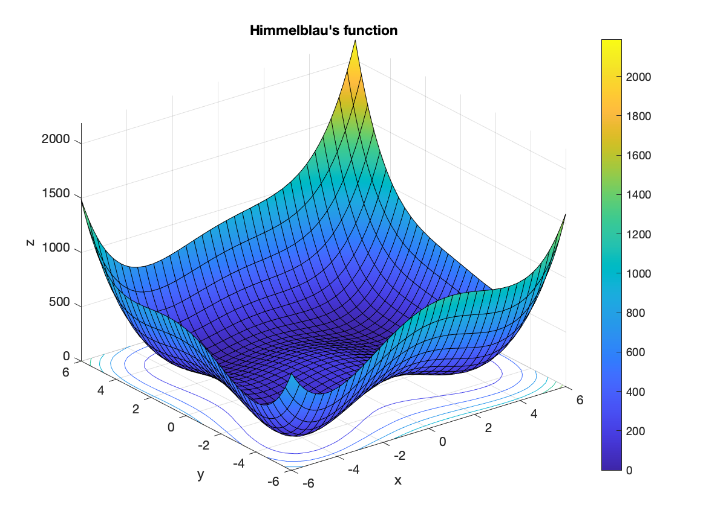

# MATLAB Examples
Various MATLAB examples. 

## Optimization

### Ackley Function


```
                                                        First-order 
 Iteration  Func-count       f(x)        Step-size       optimality
     0           3          3.62538                          1.64
     1          72      3.55271e-15       0.610701           2.83  

Local minimum possible.

fminunc stopped because it cannot decrease the objective function
along the current search direction.

<stopping criteria details>

uncx =

     0     0


uncf =

   3.5527e-15
```

### Himmelblau's Function



```
                                                        First-order 
 Iteration  Func-count       f(x)        Step-size       optimality
     0           3              106                            46
     1           6           29.543      0.0217391           44.7  
     2          15         0.357542      0.0984822           4.55  
     3          18        0.0178623              1           1.51  
     4          21       0.00643766              1          0.944  
     5          24      1.00483e-06              1         0.0101  
     6          27      4.86394e-09              1       0.000474  
     7          30      5.21254e-12              1       1.93e-05  

Local minimum found.

Optimization completed because the size of the gradient is less than
the value of the optimality tolerance.

<stopping criteria details>

uncx =

    3.0000    2.0000


uncf =

   5.2125e-12
```